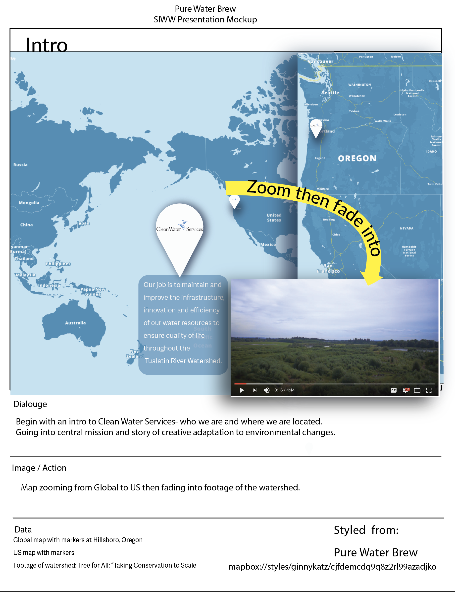

# Intro

Contributors: Ginny Katz, Bo Zhao, Courtney Von Stolk

Introduce Clean Water Services, mission and  location in the Pacific Northwest of the US in Hillsboro, OR

## Data

Stylized map of world and PNW based on 

Style options based on PWB color palette:

mapbox://styles/ginnykatz/cjgopxarh00082rp0tx41ve40

Watershed footage provided by CWS, edited for timing by Ginny. 

## Image

None

## Video

Maps will fade into CWS watershed drone footage. 

## Narrative

The story I'm telling is a global narrative that starts in Oregon in 2014. 

## tools:

https://pickvideo.net/youtube-video-downloader

http://qwinff.github.io/

