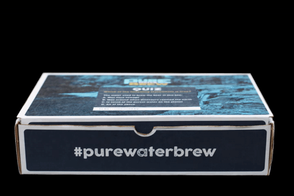

# Pure Water Brew Story Map
**Ginny Katz** | **Courtney van Stolk** | **Aradia Farmer** 

## Project Description and Goals
    How do you sell Oregon greywater to an audience in Singapore? Even if the greywater is packaged as a tempting beer call Pure Water Brew? Clean Water Services is sending a representative to Singapore International Water Week 2018. Our project supports this presentation and will also be an online product displayed on Clean Water Services' website.

## Technical Summary
### Header
After loading the standard title/UTC/data type header, we loaded the CSS stylesheets that define our presentation:
```html
<!--<link rel="stylesheet" href="https://maxcdn.bootstrapcdn.com/bootstrap/4.1.0/css/bootstrap.min.css">-->
    <!-- Google Fonts -->
    <link href="css/google-fonts.css" rel="stylesheet">
    <!-- CSS Base -->
    <link rel="stylesheet" type='text/css' media='all' href="css/webslides.css">
    <link rel="stylesheet" href="css/all.css">
    <!--<link rel="stylesheet" href="https://cdnjs.cloudflare.com/ajax/libs/leaflet/1.3.1/leaflet.css">-->
    <link rel="stylesheet" href="css/leaflet.css">
    <!-- Mapbox GL -->
    <link  rel='stylesheet' href="css/mapbox-gl.css"/>
    <!--<link rel="stylesheet" href="https://cdnjs.cloudflare.com/ajax/libs/animate.css/3.5.2/animate.min.css">-->


    <link rel="stylesheet" type="text/css" media="all" href="css/style.css">

    <link rel="shortcut icon" href="img/new-logo.png">
    <link rel="apple-touch-icon icon" sizes="192x192" href="img/new-logo.png">
```
Secondly, we loaded in the javascript libraries that would run part of the applications:
``` html
<script src="js/starfield.js"></script>
    <script src="js/leaflet.js"></script>
    <script src="js/proj4.js"></script>
    <script src="js/proj4leaflet.min.js"></script>
    <script src="js/leaflet.ajax.min.js"></script>
    <script src="js/mapbox-gl.js"></script>
    <script src="js/leaflet-mapbox-gl.js"></script>
    <script src="js/jquery.min.js"></script>
    <!-- Load d3.js -->
    <script src="js/d3.v5.min.js"></script>
    <!-- Load billboard.js -->
    <link rel="stylesheet" type="text/css" href="css/billboard.min.css"/>
    <script src="js/billboard.min.js"></script>
    <script src="js/chroma.min.js"></script>
    <script src="js/webslides.min.js"></script>
    <script src="js/Leaflet.SwoopyArrow-customized.js"></script>
```
Lastly, we brought in the data assets used in our geovisualiations. We had embedded the ```.json``` data in ```js``` files so that it could be handled directly by the javascript libraries instead of having to use a go-between such as Ajax.
```html
    <script src="assets/data/kits.js"></script>
    <script src="assets/data/media.js"></script>
    <script src="assets/data/lake.js"></script>
```

### Body
The body of our code consists of two parts: the ```header``` which contains navigation, and the ```main``` section which contains the page content for each scene. The ```header``` section contains the logo, project name, and links to the presentation in both English and Chinese.
```html
<header role="banner">
    <nav role="navigation">
        <span class="logo"><a href="index.html" title="Pure Water Brew"> Pure Water Brew</a></span>
        <ul>
            <li>
                <a  href="index.html" title="English">
                    EN
                </a>
            </li>
            <li>
                <a>|</a>
            </li>
            <li>
                <a  href="index2.html" title="中文">
                    中文
                </a>
            </li>
        </ul>
    </nav>
</header>
```
After this the ```main``` section contains an ```article``` container that holds the 17 ```section``` code blocks which each describe a scene.  In this project there are three stypes of ```section``` blocks: media backgrounds, maps, and charts. In lieu of inserting the massive entirety of the code here we will present one example of each.
Most of the sections have the format of an image or video with a text overlay. An example of this is scene "Preparing the New Normal"
```html
        <!--3.Innovation due to Pressure-->
        <section class="fullscreen bg-apple">
            <video class="background-video dark" autoplay muted loop>
                <source src="assets/innovate.mp4" type="video/mp4">
            </video>
            <div class="wrap"><h1>Preparing for the New Normal</h1></div>
        </section>
```
Another type of media slide has embedded text and videos over a dark background.
```html
                <div class="grid vertical-align">
                    <div class="column">
                        <ul class="flexblock specs">
                            <li>
                                <div>
                                    <h2>Department of Environmental Quality, Oregon</h2>
                                    <p> Using recycled water will become increasingly important in our region as demands on our water resources increase.</p>
                                </div>
                            </li>
                            <li>
                                <h2>Environment Protection Agency, U.S.A</h2>
                                <p> Pure Water Brew is an excellent example of our ability to take water that is otherwise thought of as waste and put it to direct positive value- as a beer.</p>
                            </li>
                        </ul>
                    </div>
                    <div class="column">
                        <figure>
                            <div class="embed">
                                <video autoplay loop muted poster="">
                                    <source src="assets/epa-interview2.mp4" type="video/mp4">
                                </video>
                            </div>
                        </figure>
                    </div>
                </div>
```
Others have a map background created in Leaflet. An example is the sending a message scene, which creates a container for a map.
```html
        <!--9.Sending the message-->
        <section class="bg-apple slide-top">
            <div id="mymap2"></div>
            <div class="wrap fadeInUp bg-trans-light aligncenter size-30">
                <h2>Sending the Message</h2>
                <!--<span class="background dark" style="background-image:url('img/kit.gif')"></span>-->
                <!---->
            </div>
```
One scene contains a chart.
```html
        <!--4. Leader & Catalyst to a water smart society-->
        <section class="bg-apple aligncenter">
            <div class="wrap size-70">
                <h2>Water Supplies in an Uncertain Climate</h2>
                <br/> <br/> <br/> <br/> <br/>
                <div id="chart" class="aligncenter"></div>

            </div>
            <!-- .end .wrap -->
        </section>
```
Finally, there is a footer section.
```html
<footer>
    <div class="wrap">

            <span class="alignright">
                <a href="https://www.cleanwaterservices.org/about-us/clean-water-institute/" title= "Clean Water Service"> </a>
                &nbsp;&nbsp;&nbsp;&nbsp;
                <a href="https://www.cleanwaterservices.org/about-us/clean-water-institute/" title= "Clean Water Institute"> </a>
&nbsp;&nbsp;              &nbsp;&nbsp;&nbsp;&nbsp;
                <a href="https://www.cleanwaterservices.org/about-us/clean-water-institute/" title= "SWII"> </a>
            </span>

    </div>
</footer>
```
These scenes may seem short, but this is because the majority of the content is created in the following section: Scripts.

### Scripts
This project uses a wide variety of Javascript functions to create maps, charts, word universes, color schemes, and icons. We'll address these one by one.

The majority of code in this section goes into creating three web maps: the first map that zooms in from Singapore to Oregon, a second map that shows beer media locations, and a third that shows where PWB sent gift boxes.

```Ginny please add map things here because you understand them better than I do```

The two word universes show positive and negative feedback for PWB, and were created using the ```starfield.js``` library and the ```tweets.js``` dataset. An example of one of these is shown below.
```javascript
 if (crtDiv.attr("id") === "worduniverse") {
            $("#worduniverse")
                .empty()
                .append('<canvas id="canvas2d"></canvas>');
            new StarField('worduniverse', ["321","321", "321"], 2).render(40, 3);
        }
```

The chart displays data on water levels in Hagg Lake, and was created using ```Billboard.js```.
```javascript
        var chart = bb.generate({
            data:{
                x: "Time",
                json: lake,
                keys: {
                    value: ["STRG2013", "STRG2014","STRG2015","STRG2016", "yearAVG", "Time"],
                }
            },
            point: {
                show: false
            },
            axis: {
                x: {
                    type: "timeseries",
                    tick: {
                        format: "%e %b"
                    }
                }
            },
            bindto: "#chart"
        });

        chart.data.colors({
            "STRG2013": "#9bd3eb",
            "STRG2014": "#0494bc",
            "STRG2015": "#fadb1d",
            "STRG2016": "#9c8912",
            "yearAVG": "#ffffff"
        });
        chart.axis.labels({
            x: "Month",
            y: "Water Storage in Acre-Feet"
        });
        chart.data.names({
            "STRG2013": "2013",
            "STRG2014": "2014",
            "STRG2015": "2015",
            "STRG2016": "2016",
            "yearAVG": "5 year average"
        });

        if (crtDiv.attr("id") === "chart-section") {
        }
```

## Sketch

## Design Scheme

## Data Sources

For water storage data at Hagg Lake (a.k.a. Scoggins Reservoir), I turned to the Bureau of Land Management’s Pacific Northwest Hydromet Historical Data Access portal. 
<https://www.usbr.gov/pn-bin/inventory.pl?site=SCO&ui=true&interval=daily>
I downloaded data for 2012-2013, added it into an Excel file, and calculated a five-year average. I then created a chart that showed water storage volumes in acre-feet in the lake for 2013-2016 and the 5-year average

Videos in presentation: Footage was provided by Clean Water Services.

Beer locations: Cities provided by Clean Water Services. Points created using geojson.io based on city locations on the basemap.

## Applied Libraries
This project is build on the work of the developers who have made the following platforms open for re-use:

Webslides: HTML library used to create the interface of the project
https://webslides.tv/#slide=1

Google Fonts: provided fonts
Cairo: designed by Mohamed Gaber https://fonts.google.com/specimen/Cairo
Roboto: designed by Christian Robertson https://fonts.google.com/specimen/Roboto

Fontastic.me: source for icons

Leaflet: open-source javascript library to create integrated web maps
https://leafletjs.com/

Billboard: open-source javascript library to create the chart in scene 5
https://naver.github.io/billboard.js/

Chroma: open-source javascript library which created color schemes for the web maps
https://github.com/gka/chroma.js/

Starfield.js: a javascript library which we used to display keywords
https://gist.github.com/samliew/fdf0858873fedcdc6a2e14aab8165832

D3: open-source javascript library for DOM manipulation
https://d3js.org/

Proj4.js: an open-source javascript library for map projections
http://proj4js.org/

Leaflet.curve: this publically available javascript code is used to display curved lines on Leaflet; Bo used it to create curving arrows for the maps in this project. 
https://github.com/elfalem/Leaflet.curve

## Credits
